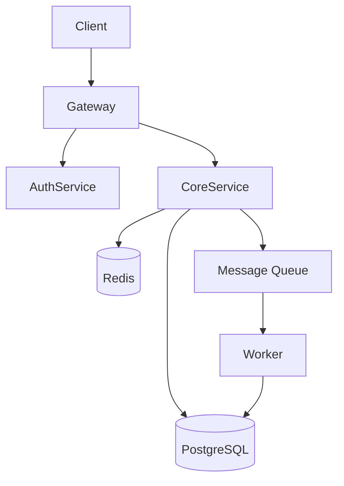
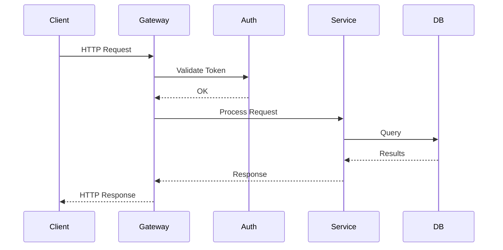

# System Architecture

## When to Use

Invoke this skill for system-level design decisions: choosing between monolith and microservices, designing module boundaries, evaluating tech stacks, or visualizing architecture.

## Architecture Decision Framework

### Step 1: Map Requirements to Patterns

| Requirement | Recommended Pattern |
|-------------|-------------------|
| Rapid MVP, small team (1-5) | Modular Monolith |
| Independent team deployments | Microservices |
| Complex domain logic | Domain-Driven Design |
| Different read/write patterns | CQRS |
| Audit trail, temporal queries | Event Sourcing |
| Heavy third-party integrations | Hexagonal (Ports & Adapters) |
| Real-time features | Event-driven + WebSocket |
| Offline-first | Local-first with sync |

### Step 2: Evaluate Trade-offs

| Pattern | Complexity | Scalability | Maintainability | Deployment |
|---------|-----------|-------------|-----------------|------------|
| Monolith | Low | Vertical | High (when small) | Simple |
| Modular Monolith | Low-Medium | Vertical | High | Simple |
| Microservices | High | Horizontal | Medium | Complex |
| Serverless | Medium | Auto | Low (cold starts) | Very simple |
| Event-Driven | High | Horizontal | Medium | Medium |

### Step 3: Apply the Hybrid Default

**Start with a modular monolith.** Extract services only when:
- A module has significantly different scaling needs
- A team needs independent deployment cadence
- Technology constraints require separation
- The domain boundary is well-understood and stable

## Module Design Principles

### Coupling and Cohesion

| Goal | Measure |
|------|---------|
| **Low coupling** | Modules communicate through interfaces, not implementations |
| **High cohesion** | Everything in a module serves the same purpose |

### Dependency Rules

```
Outer layers depend on inner layers, never the reverse.

┌──────────────────────────────┐
│  Infrastructure (DB, HTTP)    │  ← depends on
│  ┌──────────────────────┐    │
│  │  Application (Use Cases) │  ← depends on
│  │  ┌──────────────┐       │
│  │  │  Domain (Core) │       │  ← depends on nothing
│  │  └──────────────┘       │
│  └──────────────────────┘    │
└──────────────────────────────┘
```

### Aleph's 1-2-3-4 Model (Case Study)

```
1 Core    = Rust Core (reasoning, state, routing)
2 Faces   = Panel (Leptos/WASM) + Bot Gateway
3 Limbs   = Native (Desktop Bridge) + MCP + Skills/Plugins
4 Nerves  = WebSocket + UDS/IPC + gRPC/NATS + JSON-RPC

Redline: Core never imports platform-specific APIs.
         UI logic lives in Leptos only, not in Tauri shell.
```

## Architecture Diagrams

### Generating Mermaid Diagrams

Component diagram:


Sequence diagram:


## Dependency Analysis

When reviewing architecture, check for:

| Issue | Symptom | Fix |
|-------|---------|-----|
| **Circular dependency** | A → B → C → A | Introduce interface, invert dependency |
| **God module** | One module imported by everything | Split by responsibility |
| **Leaky abstraction** | Implementation details in public API | Hide behind trait/interface |
| **Distributed monolith** | Microservices that must deploy together | Merge or redesign boundaries |
| **Shared database** | Multiple services write to same tables | Separate schemas, use events |

## Tech Stack Evaluation

When choosing technologies, evaluate:

| Criterion | Weight | Questions |
|-----------|--------|-----------|
| **Maturity** | High | Production-proven? Active maintenance? |
| **Team expertise** | High | Does the team know it? Learning curve? |
| **Community** | Medium | Documentation? Stack Overflow answers? |
| **Performance** | Medium | Meets requirements without heroics? |
| **Licensing** | Low | Compatible with project license? |

**Rule:** Boring technology wins. Choose the most boring technology that meets requirements.

## Anti-Patterns

- **Architecture astronaut**: Designing for problems you don't have
- **Resume-driven architecture**: Microservices because "everyone does it"
- **Distributed monolith**: Microservices without service boundaries
- **Golden hammer**: Using one pattern for everything
- **Accidental complexity**: Architecture that serves the architect, not the users
