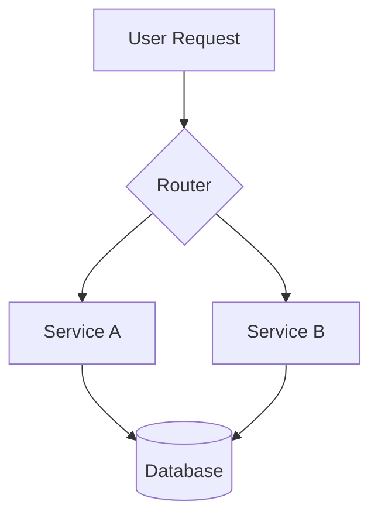

# Technical Design

## When to Use

Invoke this skill when starting a new feature, making architectural decisions, or needing to choose between multiple implementation approaches. It produces a decision record and implementation plan.

## The Design Workflow

### 1. Define Success (POE Principle Phase)

Before any design work, answer:
- What problem are we solving?
- What does "done" look like?
- What are the constraints (time, tech, team, budget)?
- What will we NOT build?

Write these down. They are the design contract.

### 2. Explore Constraints

| Constraint Type | Questions |
|----------------|-----------|
| **Technical** | What's the existing architecture? What can't we change? |
| **Performance** | What are the latency/throughput requirements? |
| **Scale** | How many users/requests/records? Growth trajectory? |
| **Team** | Who will build and maintain this? What do they know? |
| **Timeline** | When does this need to ship? |
| **Dependencies** | What external systems or teams are involved? |

### 3. Generate Options

Always propose **2-3 approaches** with trade-offs:

```
## Option A: [Name]
**Approach:** [How it works]
**Pros:** [Benefits]
**Cons:** [Drawbacks]
**Effort:** [T-shirt size: S/M/L/XL]

## Option B: [Name]
...

## Recommendation: Option [X]
**Rationale:** [Why this option wins given our constraints]
```

### 4. Decide and Document

Produce an ADR (Architecture Decision Record):

```
# ADR-NNN: [Decision Title]

Status: Accepted
Date: YYYY-MM-DD

## Context
[What situation requires a decision]

## Decision
[What we decided and why]

## Alternatives Considered
[Options explored and why they were rejected]

## Consequences
[What this enables and what it costs]
```

### 5. Visualize

Generate a Mermaid diagram for the chosen approach:



## Architecture Pattern Quick Reference

| Team Size | Recommended Start |
|-----------|-------------------|
| 1-3 | Modular monolith |
| 4-10 | Modular monolith or service-oriented |
| 10+ | Consider microservices |

| Requirement | Pattern |
|-------------|---------|
| Rapid MVP | Modular monolith |
| Independent deployment | Microservices |
| Complex domain | DDD with bounded contexts |
| Audit trail | Event sourcing |
| Read/write asymmetry | CQRS |
| Third-party integrations | Hexagonal / Ports & Adapters |

## Anti-Patterns

- **Analysis paralysis**: Spending more time deciding than it would take to build both options
- **Resume-driven design**: Choosing tech because it's trendy, not because it fits
- **Premature microservices**: Splitting before you understand the domain boundaries
- **No decision record**: Decisions forgotten and relitigated months later
- **Designing for hypothetical scale**: Build for current needs, design for 10x, worry about 100x later
